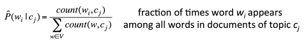
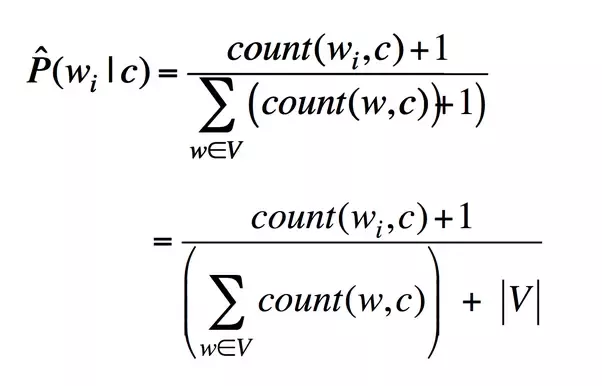

# TextClassification

## Dataset Used
[20newsgroup](http://qwone.com/~jason/20Newsgroups/)

## Methodology

  Text classification using sklearn `MultinomialNB` classifier and `MultinomialNaiveBayes` classifier written from scratch.

### NaiveBayes Probability Formula

### After Laplace correction

## Results

Classifier |Features|Train Accuracy (%) | Test Accuracy(%)
---|:---:|:---:|:---:
MultinomialNB|1791|85.44|81.84
**MultinomialNaiveBayes**|1791|87.94|85.46

